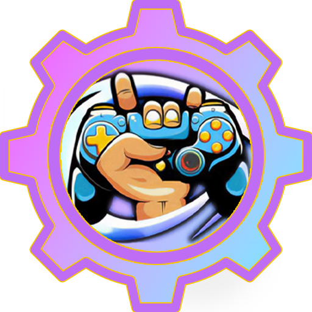
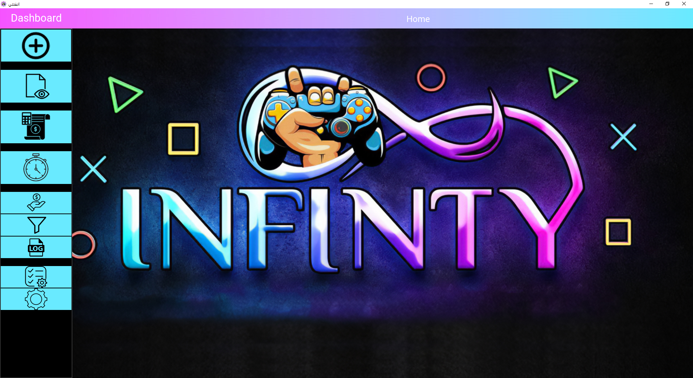
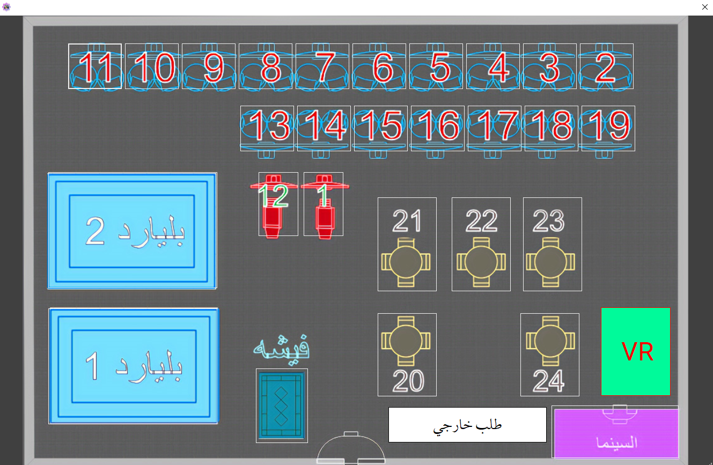
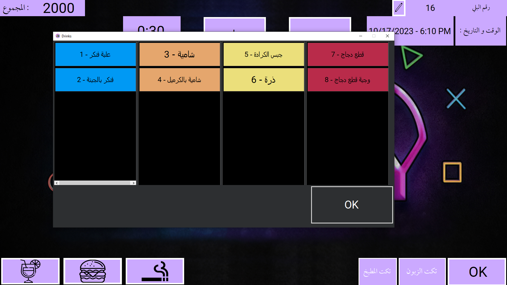
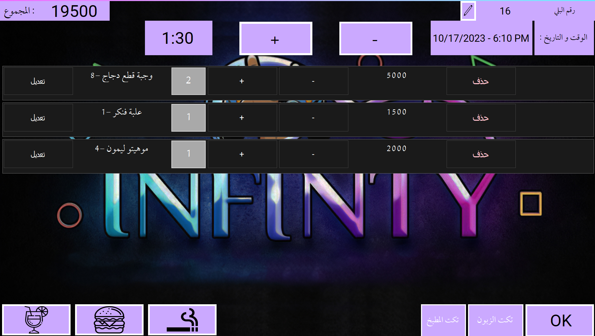
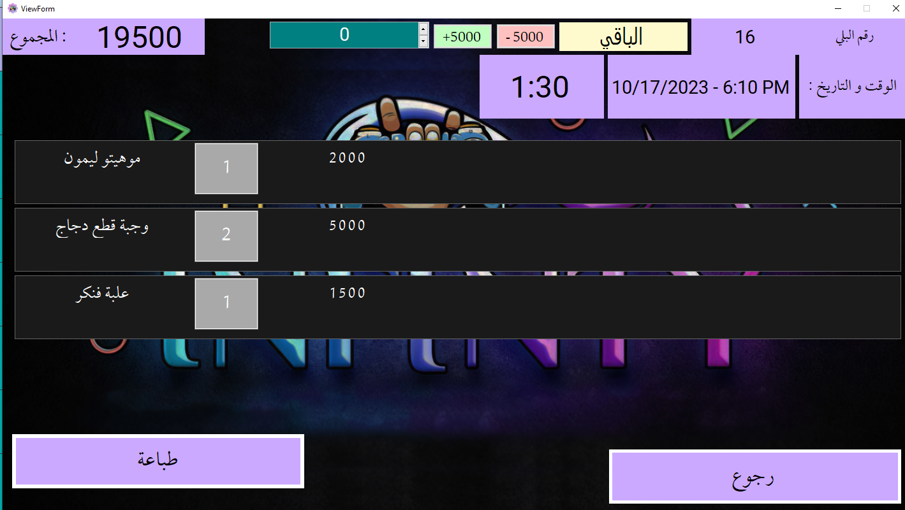
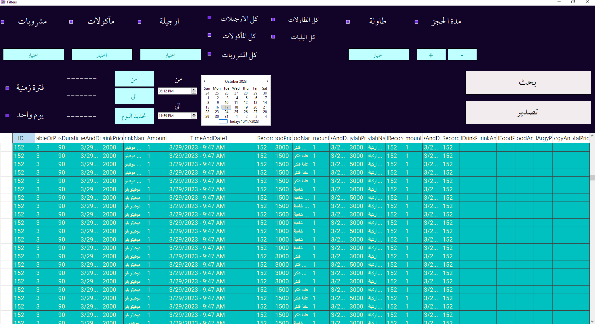
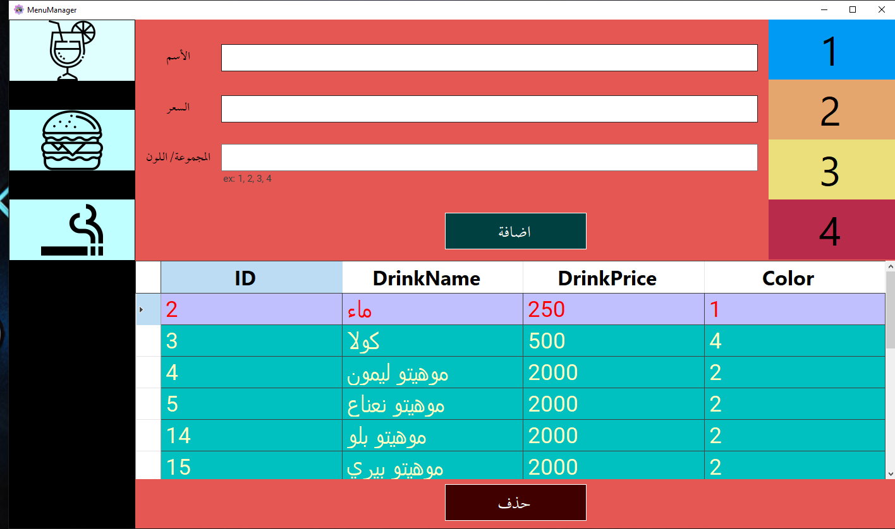

[![LinkedIn][linkedin-shield]][linkedin-url]

<!-- PROJECT LOGO -->

 

  

  <h3 align="center">Gaming Center Management Software</h3>
Gaming Center Management Software with employee and expenses control along with tickets handling and reservation auto timers

## Built With C# 

 
 </img>
  
 </img>
   
 </img>
   
 </img>
   
 </img>
   
 </img>
   
 </img>
 
 

[linkedin-shield]: https://img.shields.io/badge/-LinkedIn-black.svg?style=flat-square&logo=linkedin&colorB=555
[linkedin-url]: https://www.linkedin.com/in/it2121/

Copyright 2023 Mohammed Talib.

